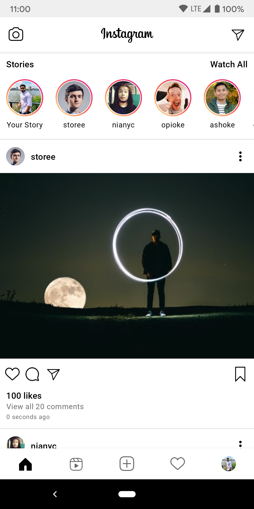

# JetInstagram

JetInstagram is an instagram clone app built with [Jetpack Compose][compose].

This sample showcases:

* Home Screen
* Post Like Button Animation
* Photo Like Animation
* Reels
* Playing Video with [Exoplayer][exoplayer] in Compose Environment

  
  
  

JetInstagram is still under development and some screens are not yet implemented.

Libraries:
* Compose Toolkit
* [Coil][coil]
* [Exoplayer][exoplayer]
* Kotlin Coroutines

[compose]: https://developer.android.com/jetpack/compose
[coil]: https://coil-kt.github.io/coil/compose
[exoplayer]: https://github.com/google/ExoPlayer

